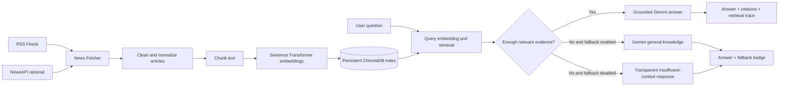
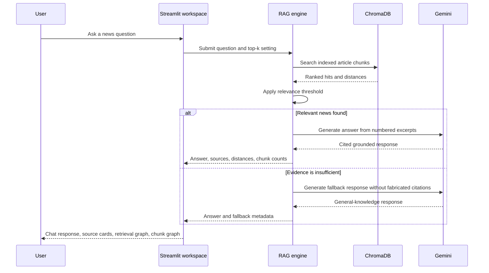

<div align="center">

# ✦ NewsPilot

### A transparent AI newsroom for asking better questions about the latest news.

NewsPilot combines live news ingestion, local semantic retrieval, and Google Gemini into a hybrid RAG workspace. When the local index contains strong evidence, the assistant answers from retrieved articles with citations. When the evidence is insufficient, it can transparently fall back to general knowledge instead of fabricating sources.

[](https://github.com/Samarssj/NewsPilot)
[](https://www.python.org/)
[](https://streamlit.io/)
[](https://ai.google.dev/)

</div>

---

## Why NewsPilot?

Traditional chat interfaces often hide where an answer came from. NewsPilot is designed around a different principle: **the answer and the evidence should be visible together**. The application retrieves relevant article chunks, scores their semantic distance, routes the question through a grounded or fallback path, and exposes the retrieval trace through interactive visualizations.

The current interface is a red-themed, responsive Streamlit workspace with a richer chat environment, source cards, retrieval-distance graphs, supporting-chunk graphs, light/dark mode, and mobile-safe sidebar behavior.

## Product Highlights

| Capability | What it provides |
| --- | --- |
| **Live news index** | Ingests current stories from RSS feeds and optional NewsAPI queries. |
| **Local semantic memory** | Chunks article text, embeds it locally, and persists it in ChromaDB. |
| **Hybrid answer routing** | Uses grounded news context when relevance is strong and optionally falls back to Gemini knowledge. |
| **Transparent citations** | Displays clickable article references beside news-grounded answers. |
| **Retrieval graph** | Visualizes article relevance distance, where lower distance means a closer semantic match. |
| **Chunk graph** | Shows how many supporting chunks were merged for each retrieved article. |
| **Responsive workspace** | Includes a collapsible mobile sidebar, explicit light-mode controls, and accessible red-theme contrast. |

## Technology Stack

<div align="center">

[](https://www.python.org/)
[](https://streamlit.io/)
[](https://ai.google.dev/)
[](https://www.trychroma.com/)
[](https://www.sbert.net/)
[](https://plotly.com/python/)
[](https://www.rssboard.org/rss-specification)
[](https://newsapi.org/)

</div>

### Stack Icon Wall

<div align="center">
  <a href="https://www.python.org/"></a>&nbsp;&nbsp;
  <a href="https://streamlit.io/"></a>&nbsp;&nbsp;
  <a href="https://ai.google.dev/"></a>&nbsp;&nbsp;
  <a href="https://www.trychroma.com/"></a>&nbsp;&nbsp;
  <a href="https://huggingface.co/thenlper/gte-small"></a>&nbsp;&nbsp;
  <a href="https://plotly.com/python/"></a>&nbsp;&nbsp;
  <a href="https://www.rssboard.org/rss-specification"></a>&nbsp;&nbsp;
  <a href="https://github.com/Samarssj/NewsPilot"></a>
  <br>
  <sub><b>Python</b> · <b>Streamlit</b> · <b>Gemini</b> · <b>ChromaDB</b> · <b>Sentence Transformers</b> · <b>Plotly</b> · <b>RSS</b> · <b>GitHub</b></sub>
</div>

| Layer | Implementation |
| --- | --- |
| **Interface** | Streamlit, custom CSS, responsive layout, Plotly charts |
| **Language** | Python |
| **Generation** | Google Gemini Generative AI |
| **Embeddings** | Sentence Transformers with `all-MiniLM-L6-v2` by default |
| **Vector store** | Persistent ChromaDB collection |
| **Ingestion** | RSS feeds, optional NewsAPI, BeautifulSoup, newspaper3k |
| **Configuration** | `.env` variables with optional Streamlit secrets support |

The interface uses Streamlit [1], generation uses Google Gemini [2], vector persistence uses ChromaDB [3], embeddings use Sentence Transformers [4], and retrieval charts use Plotly [5]. RSS ingestion follows the RSS 2.0 format [7], while NewsAPI remains an optional news provider [6].

## Architecture



The retrieval engine does not force unrelated articles into an answer. It filters results using a configurable distance threshold and minimum-relevance rule. The interface receives the same retrieval metadata used for routing, which keeps the charts and answer badges tied to real query results rather than simulated analytics.

## End-to-End Workflow



## Interface Tour

The workspace is organized around five visible surfaces:

1. **Hero workspace.** A concise explanation of the assistant’s routing behavior, live index size, retrieval mode, and top-k configuration.
2. **Session metrics.** Indexed chunks, conversation turns, latest relevant hits, and current answer mode.
3. **Chat environment.** Suggested investigations, answer-source badges, clickable source cards, and a persistent chat input.
4. **Retrieval inspection.** Interactive Plotly charts for relevance distance and supporting chunks per article.
5. **Control sidebar.** News refresh, topic filtering, full-text extraction, top-k, relevance threshold, fallback behavior, theme switching, and conversation reset.

## Project Structure

```text
NewsPilot/
├── app.py                 # Streamlit workspace and visualization layer
├── config.py              # Environment, model, chunking, and retrieval settings
├── news_fetcher.py        # RSS and NewsAPI ingestion
├── vector_store.py        # Chunking, embeddings, ChromaDB persistence, retrieval
├── rag_engine.py          # Relevance routing and Gemini answer generation
├── ingest.py              # Command-line news ingestion
├── ask.py                 # Command-line question answering
├── feeds.txt              # Custom RSS feed URLs
├── requirements.txt       # Python dependencies
├── runtime.txt            # Runtime declaration
└── data/
    └── chroma/            # Local persistent vector index, created at runtime
```

## Quick Start

### 1. Clone the repository

```bash
git clone https://github.com/Samarssj/NewsPilot.git
cd NewsPilot
```

### 2. Create and activate a virtual environment

```bash
python -m venv .venv
source .venv/bin/activate
```

On Windows PowerShell:

```powershell
.venv\Scripts\Activate.ps1
```

### 3. Install dependencies

```bash
pip install -r requirements.txt
```

### 4. Configure environment variables

Create a `.env` file in the project root:

```env
GEMINI_API_KEY=your_gemini_api_key
NEWSAPI_KEY=your_optional_newsapi_key
```

`NEWSAPI_KEY` is optional because the application can ingest from the configured RSS feeds. Keep `.env` private and do not commit credentials.

### 5. Launch the workspace

```bash
streamlit run app.py
```

Then open the local Streamlit URL shown in your terminal. Use **Refresh news index** in the sidebar before asking questions if the local collection is empty.

## Command-Line Usage

Fetch and index the latest news:

```bash
python ingest.py
```

Fetch without full-text extraction:

```bash
python ingest.py --no-fulltext
```

Fetch for a topic or custom feed file:

```bash
python ingest.py --query "artificial intelligence"
python ingest.py --feeds feeds.txt
```

Ask a question from the command line:

```bash
python ask.py "What are the latest developments in AI regulation?"
```

## Retrieval Controls

| Setting | Meaning |
| --- | --- |
| **Top-k** | Maximum number of distinct articles considered for a question. |
| **Relevance threshold** | Maximum semantic distance accepted as grounded evidence; lower values are stricter. |
| **Minimum relevant chunks** | Minimum number of threshold-passing results required for the news route. |
| **General-knowledge fallback** | Allows Gemini to answer when the local news index is not sufficiently relevant. |
| **Chunk size and overlap** | Controls how article text is segmented before embedding. |

## Answer Routing

| Retrieval condition | UI behavior | Source label |
| --- | --- | --- |
| Strong article matches | Generates an answer from numbered excerpts and displays citations. | **Grounded in live news** |
| No strong matches, fallback enabled | Generates a general response without pretending that uncited claims came from the news index. | **General knowledge fallback** |
| No strong matches, fallback disabled | Explains that the local context is insufficient. | **Strict live news** |

## Development Notes

ChromaDB persists the local collection under the configured `CHROMA_PATH`. Article content may come from full-text extraction or RSS summaries when extraction is unavailable. Paywalled or highly dynamic pages may only contribute their feed summary. Retrieval quality depends on index freshness, source quality, chunking parameters, and the configured embedding model.

The current interface stores the conversation and retrieval trace in Streamlit session state. Long-term user accounts, shared histories, scheduled ingestion, and cloud-hosted vector storage remain natural next steps for a production deployment.

## References

[1]: https://streamlit.io/ "Streamlit — build data apps in Python"
[2]: https://ai.google.dev/ "Google AI for Developers"
[3]: https://www.trychroma.com/ "Chroma — AI-native open-source embedding database"
[4]: https://www.sbert.net/ "Sentence Transformers documentation"
[5]: https://plotly.com/python/ "Plotly Python graphing library"
[6]: https://newsapi.org/ "NewsAPI documentation"
[7]: https://www.rssboard.org/rss-specification "RSS 2.0 Specification"

## License

This project is intended for educational, research, and portfolio use. Extend it responsibly, keep credentials private, and verify cited sources before making consequential decisions.
